# Welcome to my workspace!
Welcome to Hongxi Pan's workspace! 

# Outline
[week 2](README.md#week-2)

[week 1](README.md#week-1)

---

# Github Background Information & Context
If you’re new to GitHub, you can think of this as a shared file space (like a Google Drive folder, or a like a USB drive that’s hosted online.) 

This is your space to store project files, videos, PDFs, notes, images, etc., and (hopefully, neatly) organize so it's easy for viewers (and you!) to navigate. That said, it’s super easy for you to share any file or folder with us (your TDF instructional team) - just send us the link!  As a start, feel free to simply add images to the `/assets` folder, which is located [here](/assets). 

The specific file that I’m typing into right now is the **README.md** for this repo. 
##### (💡 TIP: The .md indicates that we’re using [Markdown formatting.](https://www.markdownguide.org/cheat-sheet/)) #####
<h6> (💡 TIP 2: GitHub Markdown supports <a href="https://gist.github.com/seanh/13a93686bf4c2cb16e658b3cf96807f2"> <em>HTML formatting</em> too, including emojis 😄</a>, in case that helps!) </h6>

### :star: Whatever you write in your **README.md** will show up on the “front page” of your GitHub repo. This is where we’ll be looking for your [weekly progress reports](https://github.com/Berkeley-MDes/24f-desinv-202/wiki/3.0-Weekly-Submissions#weekly-progress-report). They might look something like this: ###

# Week 2 #
## Week of 09/12/2024

This week:
1.diagram of the workflow in GH

I tried to figure out every step in the sample file, took screenshots of them and made the images into a flowchart. I think it is clear for me to understand how it works.

2.play with the sample file

Mon.

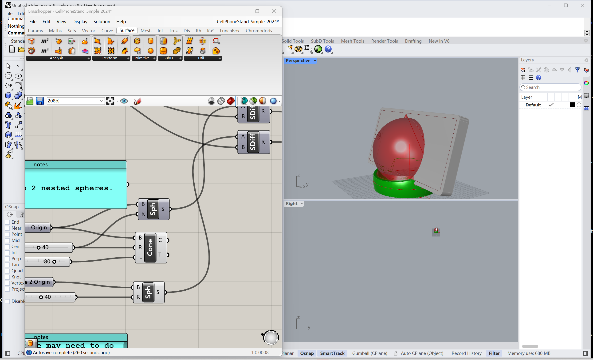

I tried to want to show all the invisible forms to figure out how the final shape was formed. (There are also some images about this in diagram)

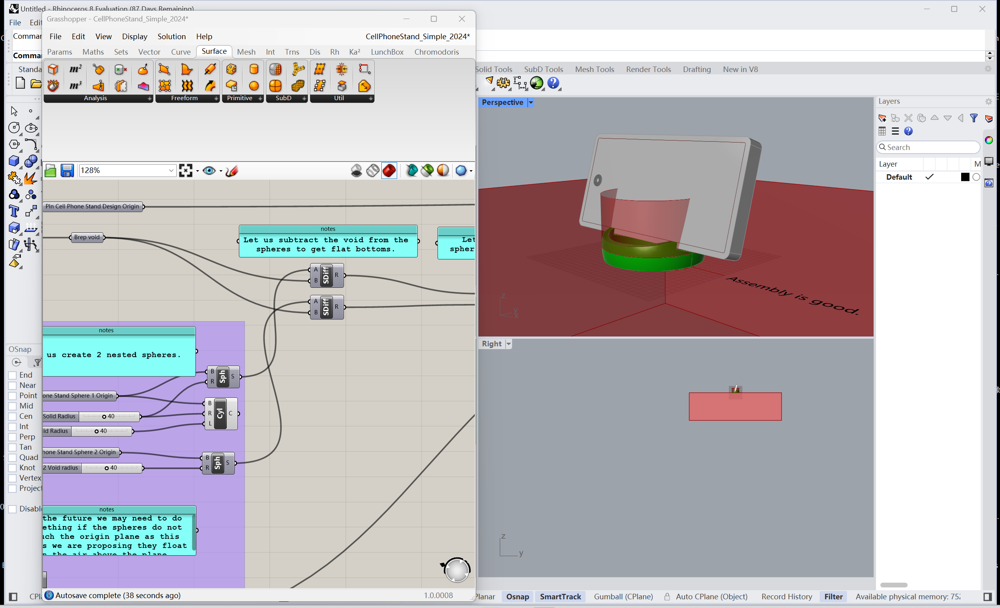

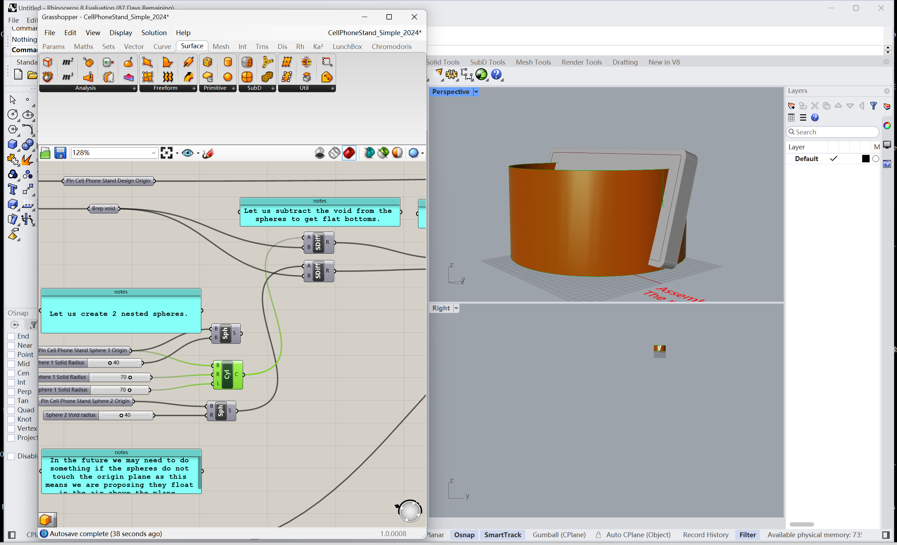

After trying to adjust all the sliders, I tried changing the shape of the base for the first time. But unfortunately this time it failed because the cylindrical shape is just a surface not a solid.

Thu.

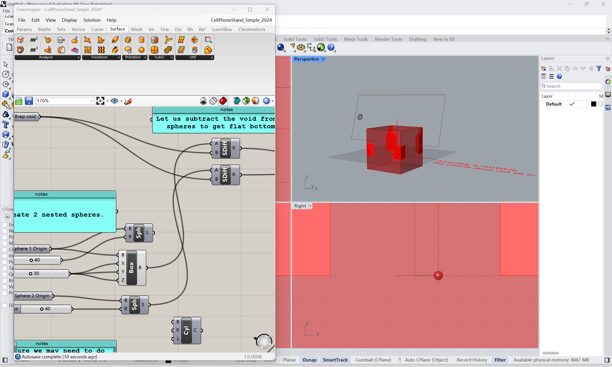

This time I decided to change the base to a cube. It didn't look very successful at first though.

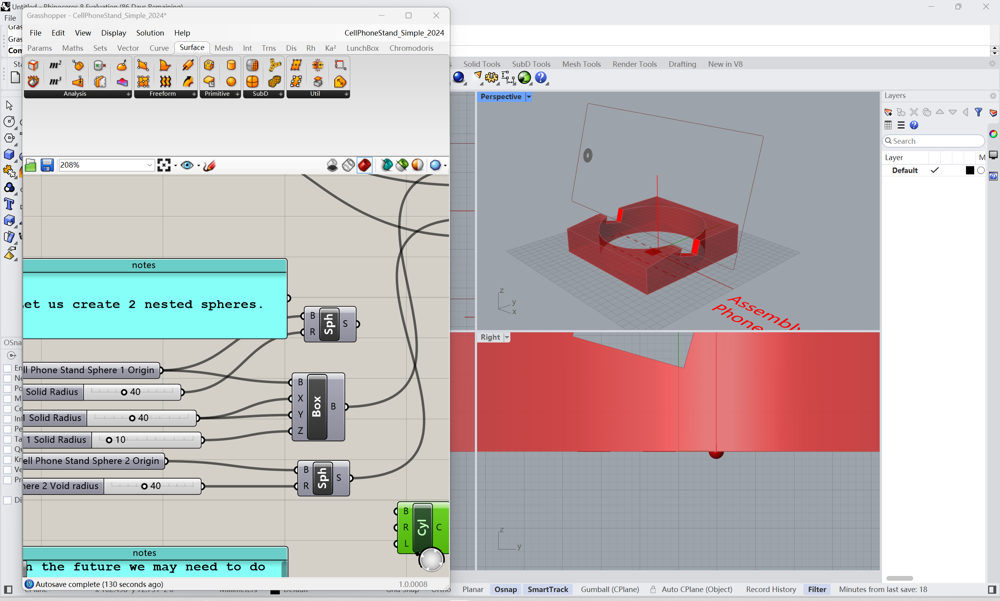

Then I realized that it was the cutting tool that was so big that it was cutting almost all of the cube off, so I adjusted some parameters.

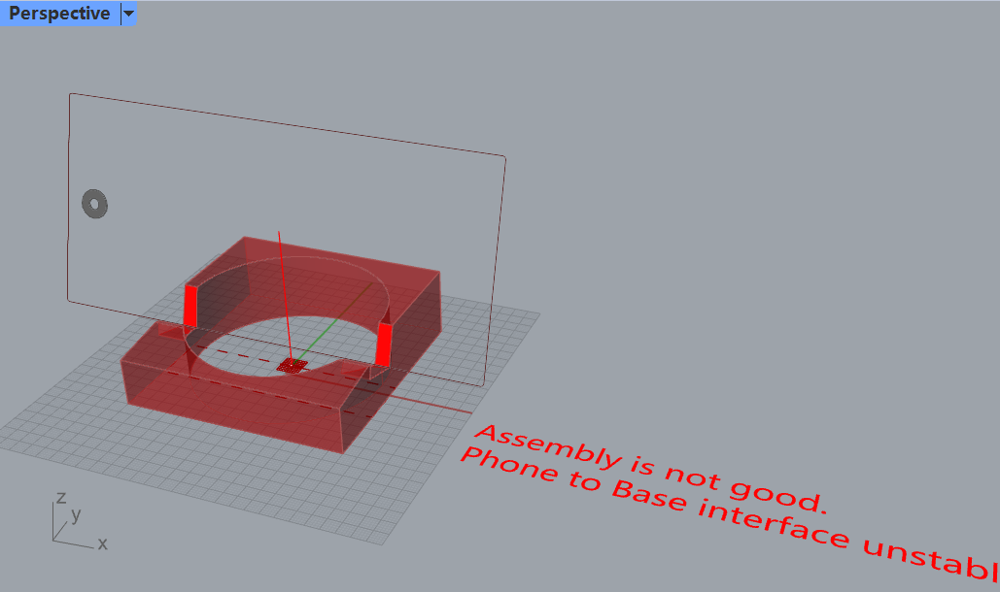

The center of gravity and assembly didn't look too good, so I adjusted the position of the base, and the size of the cut out section.

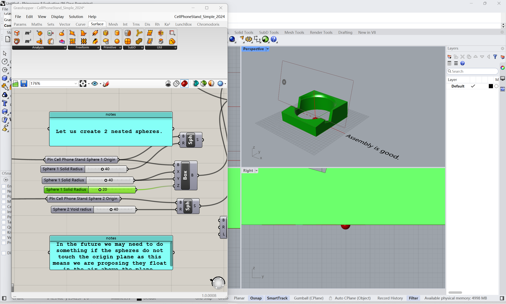

Finally green. But I didn't like the idea of a round hole in the center in the middle of a cube, so I changed it to a square.

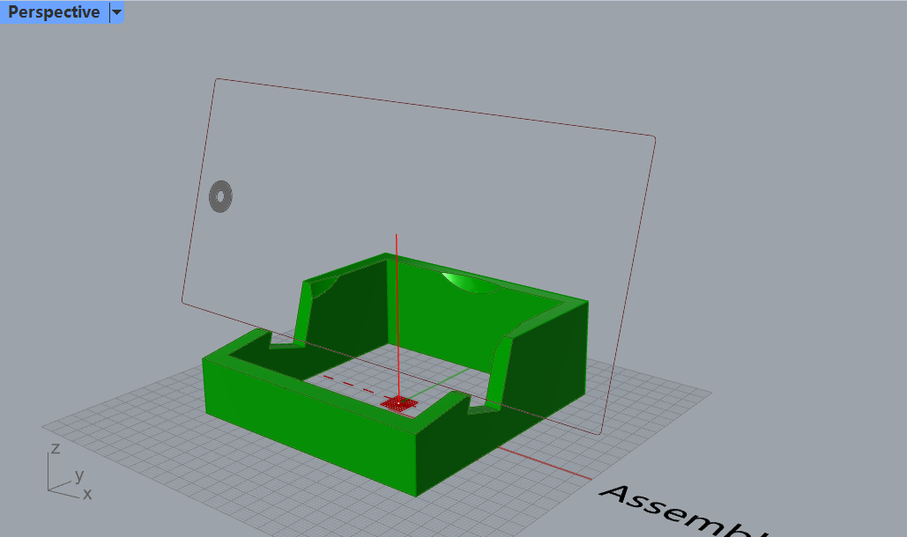

Looks good. And I baked it.

3.3D Printing.

I tried 3D printing this week. The first attempt wasn't very successful, and Cody threw it in the trash.

But neither of us were quite sure what the problem was, so Cody helped me print it on a different machine.

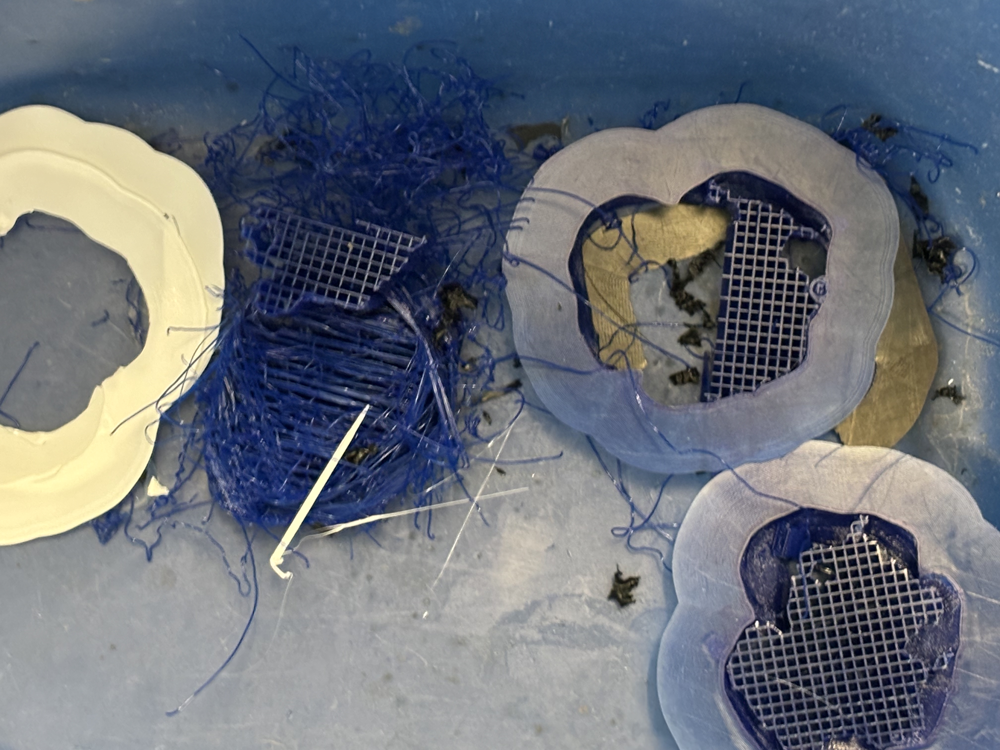

And it worked. Many thanks to Cody.

---

# Week 1 #
## Week of 09/05/2024

This week:
1. Learning how to use github, still learning how to write markdowns (like right now, hopefully I'm doing it right).

2. Got my maker pass, and still working on the laser cutter training.

3. Watched some rhino and grasshopper tutorials.

Fun stuff:

https://adam-6zhapuwfc-adam-f5567005.vercel.app/

This is a AI+CAD tool made by guys from cohort 3, and it's really cool to generate simple models from text, but that's what happens when it deals with complex semantics or relatively organic objects:

It can make a fish:

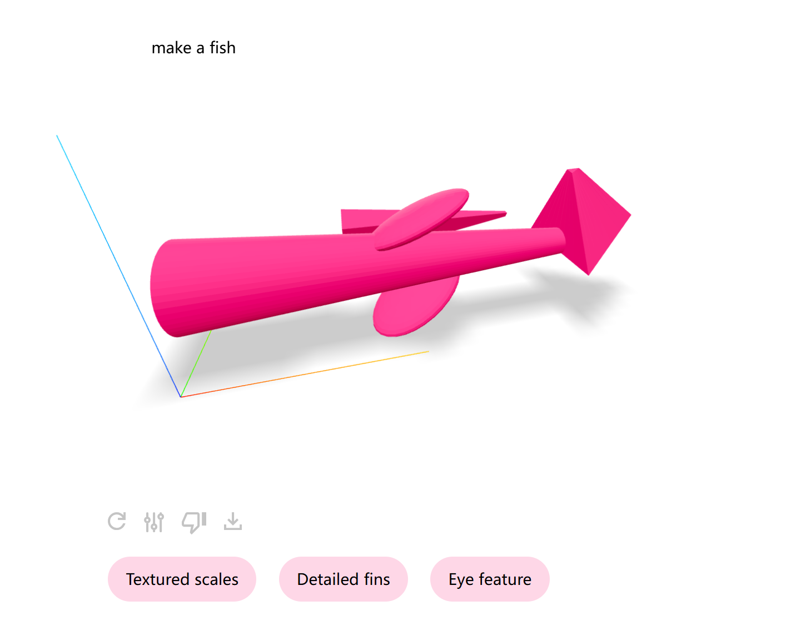

Also, this is a dog:

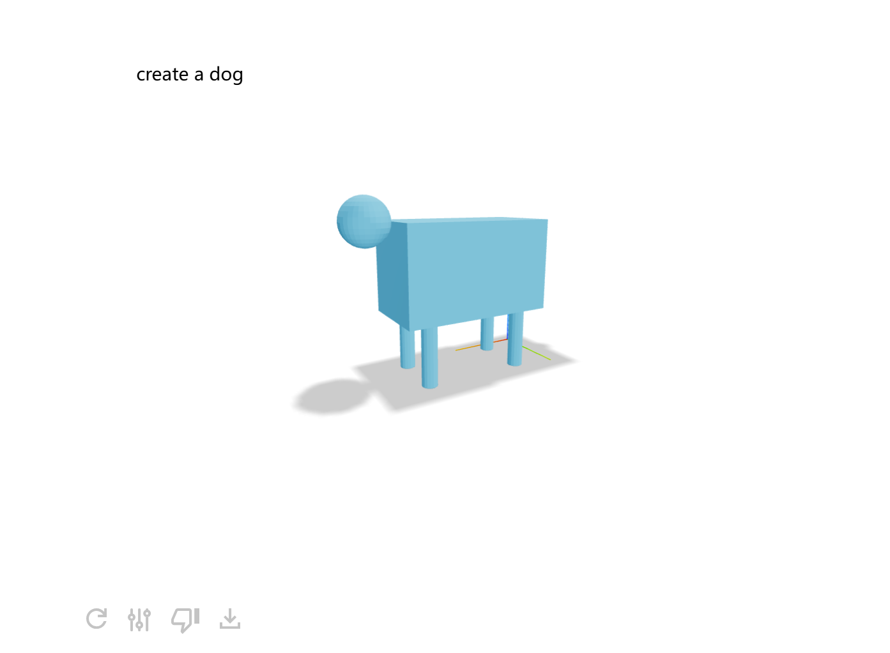

The most interesting thing is that it can also do design:

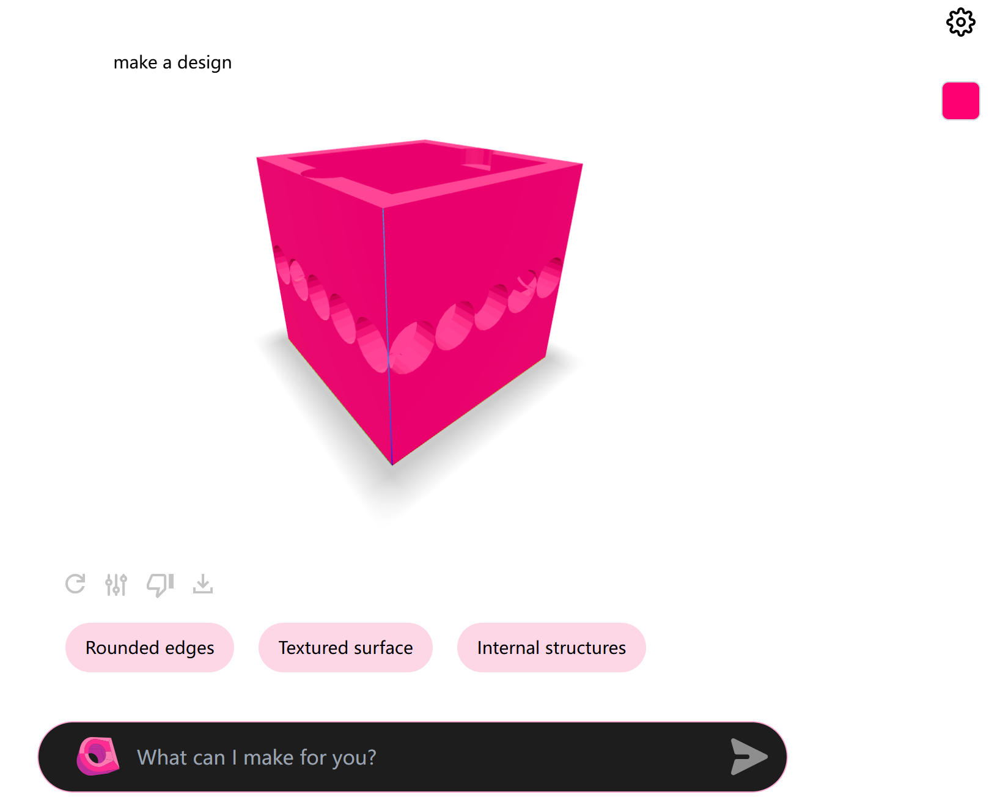

---

# Week 1: Example Report 1 #
## Week of 09/05/2024

This week, I designed a cool phone stand made of rocks. Check out all my cool sketches and progress photos from this week below, etc., etc....

---

It's time to start making this space your own! If you want to save these instructions, make a copy.  Also, feel empowered to delete everything in this README.md and start documenting! 

Excited to work with you,
your TDF teaching team

PS: let us know if you have any questions!!

PPS: 

## Quick Links, compiled here for your convenience: ##

- [TDF Wiki](https://github.com/Berkeley-MDes/24f-desinv-202/wiki) - the ultimate source for truth and information about the course and assignments
- [Google Drive Folder](https://drive.google.com/drive/u/0/folders/1DJ1b6sSDwHXX6NRcQYt10ivyQSgU0ND6) - slides and other resources
- [bCourses](https://bcourses.berkeley.edu/courses/1537533) - where the grading happens
