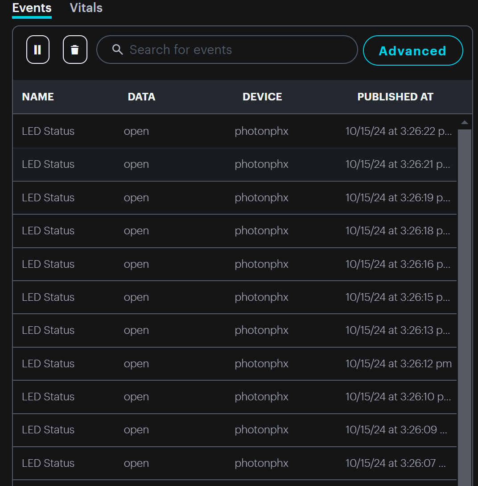
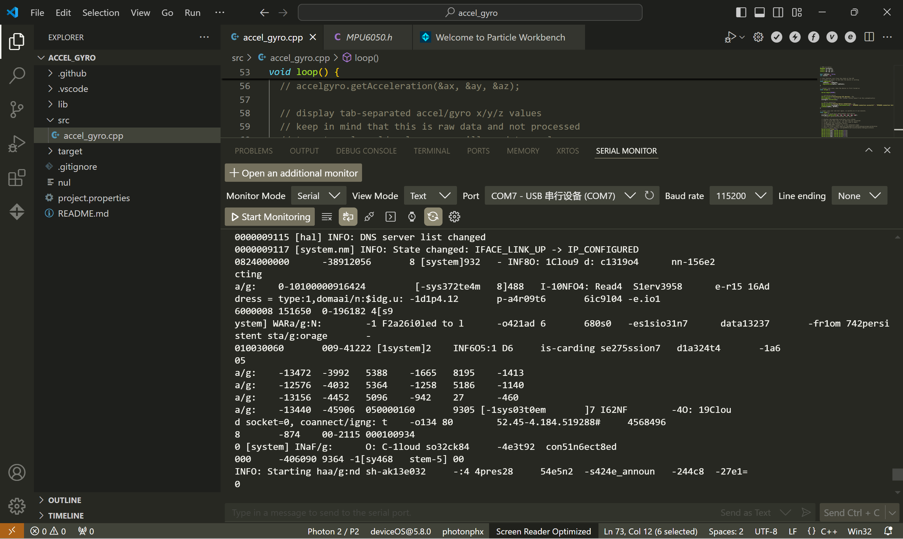

Welcome to Hongxi Pan's workspace! 

# Outline
[week 14](README.md#week-14)

[week 13](README.md#week-13)

[week 12](README.md#week-12)

[week 11](README.md#week-11)

[week 10](README.md#week-10)

[week 9](README.md#week-9)

[week 8](README.md#week-8)

[week 7](README.md#week-7)

[week 6](README.md#week-6)

[week 5](README.md#week-5)

[week 4](README.md#week-4)

[week 3](README.md#week-3)

[week 2](README.md#week-2)

[week 1](README.md#week-1)

---

# Week 14 #
## Week of 12/05/2024

This week:

### Project 4 ###

#### ML with pressure sensor ####

After setting the environment of edge impluse, I started with using pressure sensors to collect data. I did some reasearch on which points should be detected:


（citation: https://www.researchgate.net/publication/332411925_A_Method_for_Recognizing_Postures_and_Gestures_Using_Foot_Pressure_Sensors)

In this article, it is vertified that different people's walking postures and leg shapes determine the location of the most accurate monitoring points. As what we are making right now is a prototype, so we tried 3 intuitive points to test the circuit:


Then I tried to use this prototype to collect data. Because of the wires, the prototype could not fit  my shoe, so I had to tape it on my sock. I feel so embarrassed to show my feet, but this was the best I could do because I did it on holidays and my teammates were out of town. So:


In this experiment I changed the position of the sensors a little bit(above). And I detected 3 differnt activities: walking, running and standing (10 times each). Here is the result:


Speculation:

For walking and running the data pattern is relatively stable, but for standing a slight change in the user's center of gravity can mean a huge change in value. The data in the picture is my own data, and you can see that even for the same person, the data collected twice can be very different. So, there are two ways to solve this problem. The first is that I need to collect as much data as possible as a way to reach applications that are pervasive. Alternatively, I can personalize the model training for the user. However this has a high learning cost.


---

# Week 13
## Week of 11/28/2024

This week:

### Project 4 ###
I put all the content of week 13 into week 14.

---

# Week 12 #
## Week of 11/21/2024

This week:

### Project 4 ###

#### edge impluse environment building ####

In this project, we want to design a wearable product to encourage elderly to get out of their house and enjoy out door activites. It needs to be intuitive(because a lot of senior citizens are not big fans for mobile phones or they just forget them. So it would be harder to remind them to wear a smart watch everyday.) At the same time, it can provide information to the caretakers when accident happens.


In this project, I am taking the part of ML using edge impluse. It took me the whole week to build the whole environment that enables my laptop to ship data from terminal to edge impluse. I met a lot of errors, which contain:

1. visual studio c++ environment

solution: install c++ environment from visual studio. The fun stuff is that I asked a lot of people to see why it could not find visual studio on my laptop and they said that it had nothing to do with visual studio. So it took me a really long time to get here.


2. data frequency


solution:I needed to pre-process the data to meet the frequency requirement and I did some modification on the code by /4. 


#### Key reflections on ideas: ####

1. outside-house environment:

Outdoor environments are more complicated compared to indoor environment. So the traditional methods like cameras or thermography are not solutions here. We need to find another way to know exactly what the olderly person is doing with all kinds of interferences.

2. data privacy

We want to provide a reliable way to know what this person is doing, while keep other information private. (think about camera)

3. accuracy

It is hard to identify differnt activities when a person is moving. And also, unexpected movement can trigger a false alarm. So what kind of ML is the best solution and what kind of activities it need to know need to be discussed here.

---

# Week 11 #
## Week of 11/14/2024

This week:

### Report ###

This week I was focusing on my final report for project 3.


---

# Week 10 #
## Week of 11/07/2024

This week:

### Video ###

video: https://youtu.be/jT_1DnRSrqk

This week I was focusing on my video for project 3.


This is basically what I did for my project. I used DALL-E to generate a image based on the prompt, and then use GPT-4 to do the identification and summarize them into key words. The key words are used as prompt for the third AI Gemini to generate a poem based on that. The knowledge base is used to decide the style of the poem.

### Speculations ###

In the experiment I found that:

the closer I want to get this agent to me, the more data I need. Also, the more relevant the data is to the questions asked by others, the more accurate the answers will be, which means, I need to provide as much relevant information as possible. 
for generative tasks (e.g., digital poet), the more data available, the closer the results will be to the desired outcome.

So in designing the system, I provided the models with as much relevant data as possible and divided them into reasonably sized chunks. At the same time, I provided them with precise instructions so that they could locate relevant information quickly.

---

# Week 9 #
## Week of 10/31/2024

This week:

### Zerowidth ###

I already had some thoughts on the final project, so I want to prepare some knowledge for that.
Basically it is about using a camera to capture image, and indentify what is in the image and write a poem about it. So I tried to see how it can be done in Zerowidth.


I created something based on the sample file created by Peter, and it seemed that the sumarizing fuction was not working. But I think the wohole framwork was basically fine:


It seemed like it could not recognize the picture that generated by another model, so I adjusted it a little bit:


Now everything looks good, but the poem is not so...emmm...poetisch. So I made it learn from the famous Oscar Wilde:


But I found that it has not been able to poeticize the conflict. I think it is a very interesting topic. Also, some time the identification can be a little bit off. I think it is because my input can be a little bit brief and there is a lot of free space for the model to generate a detailed image. So maybe I can work on that a liitle bit more:)


### Speculations ###

The agent that I wanted to design as a poet would be more than just a tool for generating words. It could be seen as a reflective, conscious entity, capable of engaging with human emotions and societal issues through poetry. This agent, powered by LLMs, would not merely write based on images as a poet does, but would consider the broader context of human experiences, using poetry to evoke awareness, empathy, and introspection. Its poems could explore complex relationships between humanity and the environment, reflecting the intricacies of our impact on the world.

---

# Week 8 #
## Week of 10/24/2024

This week:

### Video ###

https://youtu.be/62e6_m3k8bE?feature=shared

### Merge the circut ###

I put two sensor circuits(photo cell and dial) together, linked them to a same photon, and drew a circuits diagram here.


Also, the code I wrote before only sent 1 and 0 (yes or no)to the particle cloud, so I had to add question types into this system. The logic is: the user opens the book, chooses a question type, then closes the book and think about the question, open the book, and get a answer. So what my code is doing right now is to mark the question types as strings(1,2,3), and the certain string will be sent whenever the book is detected open. Here is the modified code (just for record as well):

```C++
#include "Particle.h"

int ledPin = D7; 
int photoResistorPin = A0; 
int potentiometerPin = A2;   
int yellowLEDPin = D0;         
int greenLEDPin = D1;         
int blueLEDPin = D2;

int threshold = 200;   
int lightLevelNew, lightLevelOld;

int threshold1 = 1365;  // Potentiometer value
int threshold2 = 2730;

int type = 0; // type 0 is closed, type 123 are question types   
int potentiometerValue;

void setup() {
    pinMode(ledPin, OUTPUT);
    Serial.begin(9600);
    while (!Serial) {}

    // Initialize the first light level reading
    lightLevelOld = analogRead(photoResistorPin);
    //Particle.subscribe("0a10aced202194944a05a510/Received");

    pinMode(yellowLEDPin, OUTPUT);
    pinMode(greenLEDPin, OUTPUT);
    pinMode(blueLEDPin, OUTPUT);

    // Set up potentiometer
    digitalWrite(yellowLEDPin, LOW);
    digitalWrite(greenLEDPin, LOW);
    digitalWrite(blueLEDPin, LOW);
    
}

void loop() {
    
    lightLevelOld = lightLevelNew;

    // potentiometerPin
    
    potentiometerValue = analogRead(potentiometerPin);

    if (0 < potentiometerValue && potentiometerValue < threshold1) {
        
        digitalWrite(greenLEDPin, LOW);
        digitalWrite(yellowLEDPin, HIGH);
        digitalWrite(blueLEDPin, HIGH);
        type = 1;
    
    } 
    else if (threshold1 < potentiometerValue && potentiometerValue < threshold2) {
        
        digitalWrite(greenLEDPin, HIGH);
        digitalWrite(yellowLEDPin, LOW);
        digitalWrite(blueLEDPin, HIGH);
        type = 2;
        
    } 
    else {
       
        digitalWrite(yellowLEDPin, HIGH);
        digitalWrite(greenLEDPin, HIGH);
        digitalWrite(blueLEDPin, LOW);
        type = 3;
        
     } 

    Serial.println(potentiometerValue);

     // light sensor
    lightLevelOld = lightLevelNew;
    lightLevelNew = analogRead(photoResistorPin);  // Read the current light level
   
    Serial.print("Current Light Level: ");
    Serial.println(lightLevelNew);
    
    if (lightLevelNew > lightLevelOld + threshold) {
        digitalWrite(ledPin, LOW);  

        if(type == 1 || type == 2 || type == 3){
            Particle.publish("Question type", String(type), PUBLIC);
            Serial.println(String(type));
        } 
    }

     else if (lightLevelNew < lightLevelOld - threshold ) {
        digitalWrite(ledPin, HIGH);  // Turn LED off

        Serial.println("LED is OFF");
        type = 0;
       
    }
   
    delay(1000);
}
```
### Speculations ###

I think with this project we discussed how the digital ecosystem, including microprocessors, sensors and AI can provide emotional value to people. People tend to think that AI can't empathise, so can it act as omniscient to provide that value? Perhaps it is because we are inherently distanced from the realm of the transcendent and therefore this makes the role played by AI more plausible.

---

# Week 7 #
## Week of 10/17/2024

This week:

### photo cell - CdS ###


So, this is our part of the diagram for the whole system. 
What we are trying to do is: open the book, and it will send the message to particle cloud, which can be received by Nora(other team)'s Photon. The led will be used for debuging. 

I found two sensor maybe useful in our box, one is the cds, and the other is the HC-SR04(I don't konw it's name, but I call it distant sensor). Since the HC-SR04 can be influenced easily by the movement of the user, so I decided to try the CdS first.

After several attempts, I found that it was not easy to make everything just right:


### 1. my computer: ### 
It runs really slow in vsCode and I don't know why. It took me a lot of time compiling those codes, which means it took me more time to debug:(

### solution: ### 
There is no solution. I have to live with it.

### 2. relative value: ### 
I know the sensor reads the relative values of environmental testing, but it is not stable at all. Since there is an error in each reading, it is not possible to use the absolute value of the change to make judgments.


### solution: ### 
I used a threshold to make sure when the light changes greatly, the led lights up and sends a message. But it took a lot of experiments. And also, I added a resistor, trying to make it more stable.


### 3. Frequent messages: ### 
In the experiment, since the status of led was always detected as on after the book was opened, messages would be sent to cloud frequently, which means that requests to call the API would be sent frequently, leading to message stacking.

 

### solution: ### 
I want to keep this on/off after detection until the huge light change happens again. Therefore, the code needs to continuously detect changes in the environment (since I can't predict the interval time between two activities of the user is, I can't use delay to maintain the state).

### 4. the threshold: ### 
I had to calculate the threshold every time due to the change of multiple factors: environment, led status and the interaction with the physical book, which made the led blinking all the time.

### solution: ### 
I tried to add a hysteresis to prevent the LEDs from switching on and off frequently If the light changes above a certain threshold (positive increase or negative decrease), it will change the LED state. This prevents frequent flickering of the LED due to small light changes. But I am still working on this one.


Here is the code for now, just for record:

```C++
#include "Particle.h"

int ledPin = D7; 
int photoResistorPin = A0; 
int threshold = 300;   // Define a fixed threshold for light change
bool ledState = false;   // Track the current LED state
int lightLevelNew, lightLevelOld;

void setup() {
    pinMode(ledPin, OUTPUT);
    Serial.begin(9600);
    while (!Serial) {}
    
    // Initialize the first light level reading
    lightLevelOld = analogRead(photoResistorPin);
}

void loop() {
    lightLevelOld = lightLevelNew;
    lightLevelNew = analogRead(photoResistorPin);  // Read the current light level
    
    Serial.print("Current Light Level: ");
    Serial.println(lightLevelNew);
    
    // Check if the light level has increased significantly (by the threshold) and LED is off
    if (lightLevelNew > lightLevelOld + threshold && !ledState) {
        digitalWrite(ledPin, HIGH);  // Turn LED on
        ledState = true;  // Update the LED state
        Serial.println("LED is ON");
        Particle.publish("LED Status", "open", PRIVATE);
    } 
    // Check if the light level has decreased significantly and LED is on
    else if (lightLevelNew < lightLevelOld - threshold && ledState) {
        digitalWrite(ledPin, LOW);  // Turn LED off
        ledState = false;  // Update the LED state
        Serial.println("LED is OFF");
        Particle.publish("LED Status", "close", PRIVATE);
    }

    // Update the old light level to the new one for the next loop
    lightLevelOld = lightLevelNew;

    delay(1000);  // Wait 1 second before the next reading
}
```

### Speculations ###

Cultural expectations of the Anthropogenic Environment vary widely, with some societies prioritizing harmony with nature while others emphasize economic growth. This influences how technology and digital tools are employed—either for environmental conservation or increased development. These choices shape each society’s interaction with the environment in unique ways.

In engineering, cultural values impact how and what we create. However, the current social environment has spawned a lot of psychological problems as well as a focus on mental health. In this project, we try to use AI as the answer to all the problems in the world. Can AI act as a ‘omniscient’ when people are uncertain or confused? Based on probabilistic models, AI can generate countless ambiguous answers like those in the Book of Answers, which may lead people to think about what they really want.

During this project, we worked closely within our group and learnt from each other, which made it very rewarding for us all. We all encountered difficulties, but more importantly, we gained problem-solving skills in the process.

---

# Week 6 #
## Week of 10/10/2024

This week:

### stemma 1 - MPU6050 ###

I tried out the MPU6050 sensor, I used the sample file but there are lots of problems:


But it still worked, I could compile it and flash it:


I tried to make the circuit based on the code given, I saw there was a led in this circuit, but I could not know what it did, so I asked ChatGPT and it told me that it was for indicating the status of the sensor:

### stemma 1 - MPU6050 ###

Then I opened the serial monitor, and I could see the value of the sensor:





But it was so fast that I could not follow it :( It took really long time to compile (more than 30 mins), so I looked a little bit into some interesting application of this sensor, I saw some really fun staff like this, but I think they used Arduino or other kind of boards. There is no reference for Fhoton :( So I am still trying and want to see what I can do with it.


### stemma 2 - APDS-9960 ###

I tried the second one, which had a lot of problems but still worked:


Also, I saw a tutorial about this sensor: https://www.adafruit.com/product/3595, and here is a example using the color sensor:


My board worked perfectly, and you can see the value changed with different color:


I just realized that I didn't delete the code that detects proximity, so I can see both values in serial monitor.

### 2 - project 2 proposal ###

Our group is cooperating with Nora and Selena's group, so we discussed a system like this (There are more details in the proposal:


### Speculations ###

I think with this project we are going to discusse how the digital ecosystem, including microprocessors, sensors and AI can provide emotional value to people. People tend to think that AI can't empathise, so can it act as omniscient to provide that value? Perhaps it is because we are inherently distanced from the realm of the transcendent and therefore this makes the role played by AI more plausible.

---

# Week 5 #
## Week of 10/03/2024

This week:

### Monday - testing ###


I struggled with how to compile my file the whole weekend, it usually took more than an hour and then I had to kill it. I tried several times but it not worked.

Then with the help from Upasana, I opened this:


And then I could see every steps it took and the process took halp an hour. Then finally:


The first two file worked well, so I decided to try the blinking one.
The compiling and flashing process were successful, and I connected the circuits, it was not working:


So I checked the circuits, I realized the botton was not connected in the circuit. I fixed that, it still not worked.

Then I looked into the code, and I saw that:


Then I realized maybe I connected the wrong pin, so I fixed that.

And it started to blink and I thought the button was not working. That really confused me a lot. 

 

### Thursday - testing ###

1.I tried the LED color one, I tried to compiled the code:


But some thing went wrong and the code couldn't work. Then I decided to ask chatGPT:


Then I tried to changed the position of some lines of code, it worked:


But then I realized that I could never reach Aqua (which is my favorite color), Red was the best I can do, so I decided to look a little bit more into what was wrong.

First I wanted to see if the led could not show aqua, so I changed the setting red into aqua and see if it worked.


The led could show aqua. Then I thought since the aqua was the last stage, maybe the value couldn't reach that high, so I added the function to monitor the value of the sensor.


It showed bash, so that meant my code had error. I tried modify th code several times, then it worked, which meant I can see the real time value of the sensor in the serial monitor(refresh each second).


It turned out that it was because the best value I could reach was 3000, which means that I could never see aqua if I stuck on the original setting. So this could be fix easily, I just needed to change the value range of each color and made them under 3000, then I have all the colors. Or maybe I can change a different resistor:)

### Speculations ###

I think what's different about these new projects is that the value they enter changes from yes and no (0 or 1) to a variable value. And these values can represent any of the variables in the entire ecosystem, for example, it can be the number of the pictures that I pinned in Pinterest just now and it can indicate my level of creativity; or it can present the the humidity of air and then use AI to provide a prediction of when I should water my plants. 

Take the creativity ecosystem I demonstrated last week as an example, I think machine learning can really help with the prediction of my creativity status. Like the Pintrest using machine learning to make sure I am surrounded by the images I like, I am wondering if it possible for it to break the information cocoon and provide something new that I never noticed before? I think it is going to be very helpful to add this part into my creativity process.

---

# Week 4 #
## Week of 09/26/2024

This week:

### 1.Interaction Ecosystems ###


In this diagram, I list the interaction ecology of the output stage of the product design I'm working on, where the black text represents the function and action, and the grey represents the information being transported.

Throughout the process, my touchpoints are my laptop and iPad, processing and transferring information through web and desktop tools, and finally materialising the product through 3D printing.(As 3D printers are not personal devices, they are not listed among the touch points on the left side of the chart.)

---

# Week 3 #
## Week of 09/19/2024

This week:

### 1. work on project 1: Gh ###

video link: https://youtu.be/iMBRTu1CeQQ

I decided to challenge myself to axolotl level and start a GH project myself. I've always had a passion for jewellery design and I want to do it this time.

I found this very nice ring with hammered pattern on its surface. So I decided to make one myself. I did a little research on how these beautiful hammered patterns are created. They are hammered by these metal sticks with round balls on the end. When they are hammered, they create a recessed texture on the surface of the ring.


So my making process is clear now. First I create a cylinder, then I make it into a solid ring. I can also create some spheres around it and use Boolean to subtract their overlap with the ring.


At first, I wanted to create two surfaces (inner and outer surfaces) and then merged them togeter into a solid. But I failed. I could not cap it.


Then I tried to make a ring first. And it worked.

Since rings come in different sizes, I want users to be able to adjust the size, height, and thickness of the ring using these sliders.


Then I created another cylinder and used population geometry to randomly generate points on the surface. I can also control the number of these points. Then I generated spheres based on these points and adjust the sizes of these spheres and make sure they look good. 


And also The reason why I did not use the outer surface of the ring to generate these points is because the spheres use the points as centers, so the texture will be too deep in that case. I also connected the thickness parameters, the radius of the points surface and the size of the spheres to make sure the ring is at least 1 millimeter thick.


Then I merged these spheres into a solid and used it as a tool to cut the ring. 


Then here is the pattern. 


Based on this process I created, I made a series of rings with different sizes, heights and textures for my friends.


### 2. work on project 1: manufacturing  ###

I started my manufacturing process with a single ring because I wasn't sure if the printer would be able to achieve these subtle patterns. But it worked pretty well. 


Then I printed the whole series of my rings. 


I think it will be better to print them with metal, but this is good enough.


### 3. work on project 1: reflection  ###

I think one of the most interesting things about this project is that I tried to simulate handmade textures through parametric design and still keep some of their original characteristics, like the randomness of the patterns. I think this makes this project Axolotl level. 

I think that using computational tools in the design process allows me to think more rationally about artifacts and gives me a deeper understanding of the logic of making.:)

---

# Week 2 #
## Week of 09/12/2024

This week:

### 1. diagram of the workflow in GH ###


I tried to figure out every step in the sample file, took screenshots of them and made the images into a flowchart. I think it is clear for me to understand how it works.

### 2. play with the sample file ###

Monday


I tried to want to show all the invisible forms to figure out how the final shape was formed. (There are also some images about this in diagram)


After trying to adjust all the sliders, I tried changing the shape of the base for the first time. But unfortunately this time it failed because the cylindrical shape is just a surface not a solid.

Thursday


This time I decided to change the base to a cube. It didn't look very successful at first though.


Then I realized that it was the cutting tool that was so big that it was cutting almost all of the cube off, so I adjusted some parameters.


The center of gravity and assembly didn't look too good, so I adjusted the position of the base, and the size of the cut out section.


Finally green. But I didn't like the idea of a round hole in the center in the middle of a cube, so I changed it to a square.

Looks good. And then I baked it. (Why does it look so much like an ashtray?)


### 3. 3D Printing ###

I tried 3D printing this week. The first attempt wasn't very successful, and Cody threw it in the trash.


But neither of us were quite sure what the problem was, so Cody helped me print it on a different machine.


And it worked. Many thanks to Cody.

---

# Week 1 #
## Week of 09/05/2024

This week:
1. Learning how to use github, still learning how to write markdowns (like right now, hopefully I'm doing it right).

2. Got my maker pass, and still working on the laser cutter training.

3. Watched some rhino and grasshopper tutorials.

Fun stuff:

https://adam-6zhapuwfc-adam-f5567005.vercel.app/

This is a AI+CAD tool made by guys from cohort 3, and it's really cool to generate simple models from text, but that's what happens when it deals with complex semantics or relatively organic objects:

It can make a fish:


Also, this is a dog:


The most interesting thing is that it can also do design:


---

# Github Background Information & Context
If you’re new to GitHub, you can think of this as a shared file space (like a Google Drive folder, or a like a USB drive that’s hosted online.) 

This is your space to store project files, videos, PDFs, notes, images, etc., and (hopefully, neatly) organize so it's easy for viewers (and you!) to navigate. That said, it’s super easy for you to share any file or folder with us (your TDF instructional team) - just send us the link!  As a start, feel free to simply add images to the `/assets` folder, which is located [here](/assets). 

The specific file that I’m typing into right now is the **README.md** for this repo. 
##### (💡 TIP: The .md indicates that we’re using [Markdown formatting.](https://www.markdownguide.org/cheat-sheet/)) #####
<h6> (💡 TIP 2: GitHub Markdown supports <a href="https://gist.github.com/seanh/13a93686bf4c2cb16e658b3cf96807f2"> <em>HTML formatting</em> too, including emojis 😄</a>, in case that helps!) </h6>

### :star: Whatever you write in your **README.md** will show up on the “front page” of your GitHub repo. This is where we’ll be looking for your [weekly progress reports](https://github.com/Berkeley-MDes/24f-desinv-202/wiki/3.0-Weekly-Submissions#weekly-progress-report). They might look something like this: ###


# Week 1: Example Report 1 #
## Week of 09/05/2024

This week, I designed a cool phone stand made of rocks. Check out all my cool sketches and progress photos from this week below, etc., etc....


---

It's time to start making this space your own! If you want to save these instructions, make a copy.  Also, feel empowered to delete everything in this README.md and start documenting! 

Excited to work with you,
your TDF teaching team

PS: let us know if you have any questions!!

PPS: 

## Quick Links, compiled here for your convenience: ##

- [TDF Wiki](https://github.com/Berkeley-MDes/24f-desinv-202/wiki) - the ultimate source for truth and information about the course and assignments
- [Google Drive Folder](https://drive.google.com/drive/u/0/folders/1DJ1b6sSDwHXX6NRcQYt10ivyQSgU0ND6) - slides and other resources
- [bCourses](https://bcourses.berkeley.edu/courses/1537533) - where the grading happens
